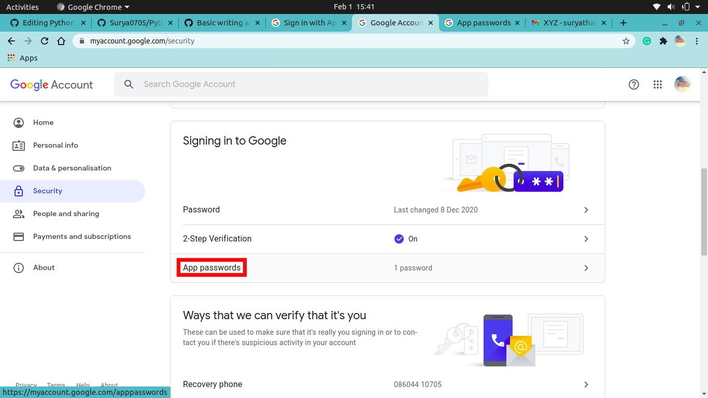

# Python_EMail_Sender
This is a Python Program that can send simple Text Mails to anyone you want. It uses a Python Module that is SMTPLIB. In my case it was in-built. Also as Mentioned in the [Main.py](Main.py) file, here I will tell you how to get App Password for SMTP. Just follow the instructions below:
1. Go to [My Accounts Site](https://myaccount.google.com/) and Click on Settings.

2. Then Scroll Down and Click on App Passwords. After Clicking you will be redirected to Sign in Page. Just Sign in there.

3. Then Click on Other.

4. Type in anything such as I have typed in SMTP and click on Generate.

5.  pop-up with 16-Digit Code written in a Yellow-Box will appear. Copy that Code and Paste it in place of the White Box of the [Code_Screenshot Image](Code_Screenshot.png)

Below is the Code Screenshot Image:

And below you can see the Screenshot that I have received the Mail which I sent in [Code_Screenshot Image](Code_Screenshot.png).

Hope that you liked it.
